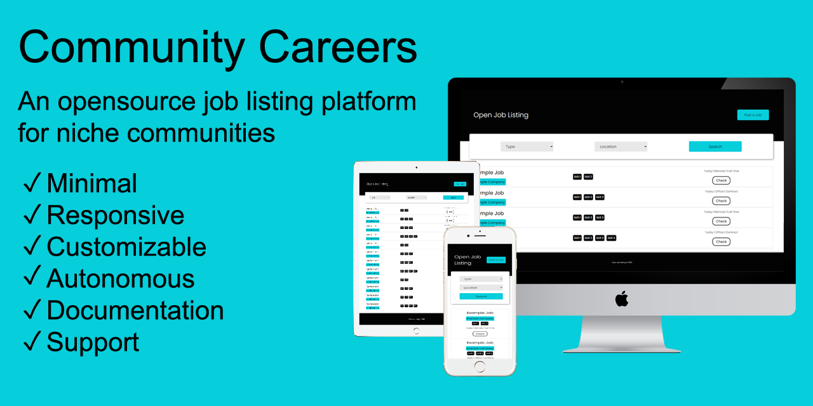
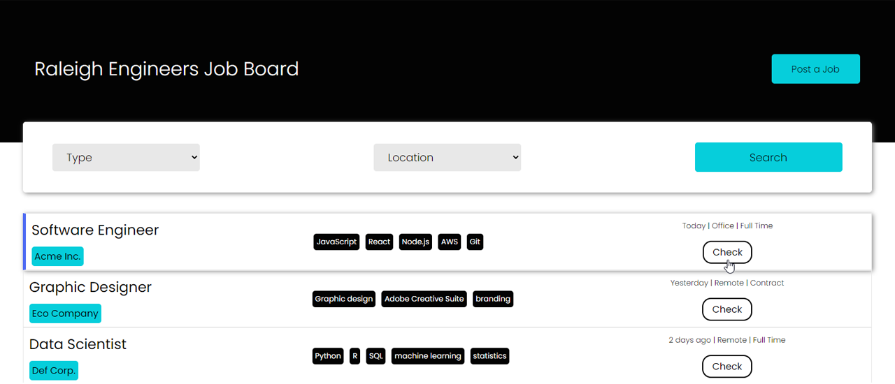
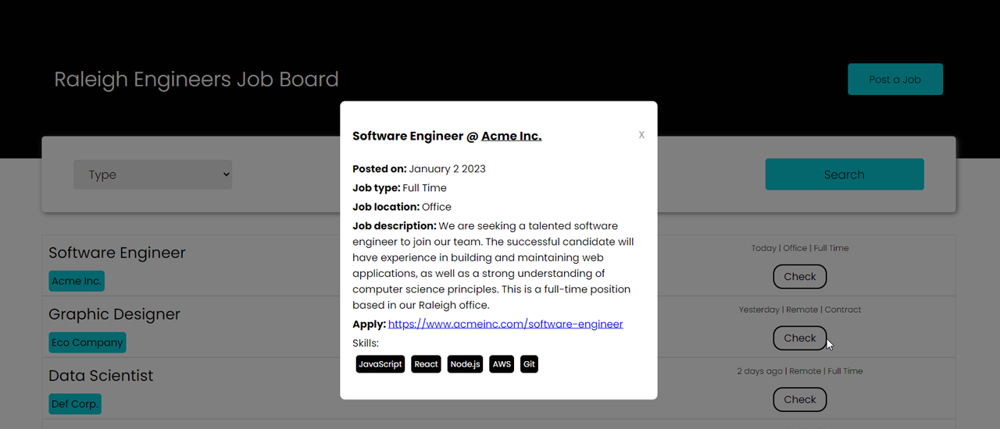
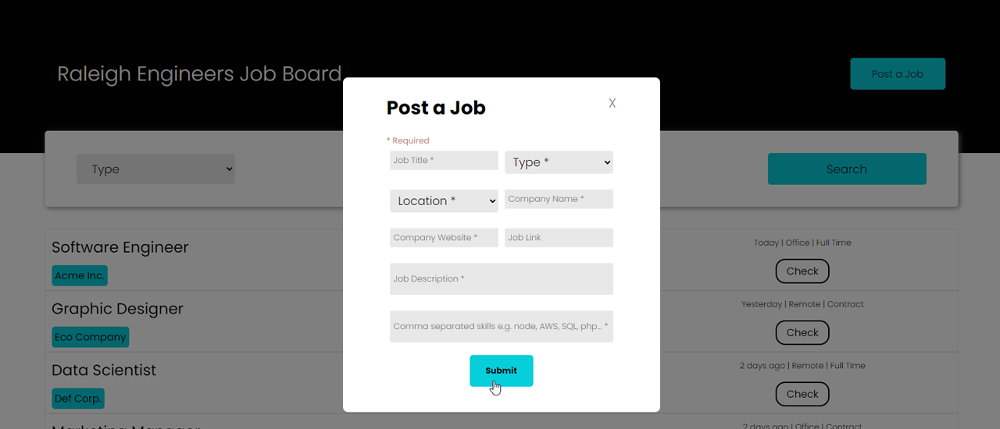

# Community Careers





## Mission
Welcome to the Community Careers repository! 

This is an open source project that aims to create a simple and easy-to-use job listing platform for niche communities. Our goal is to connect local job seekers with job openings in their area, and to help businesses find the right talent for their needs. 

The website is built with Javascript and React. We welcome contributions from the community and encourage you to fork the repository and submit pull requests. 

If you have any questions or ideas for improving the project, please open an issue.

## Screenshots


Homepage view



Checking job details view



Posting job view

## Future Optimizations
- Adding documentation
- Improving accessibility and support for marginalized and disabled users
- Adding search by skills filter
- Adding abuse filter
- Improving responsiveness

## How to Run

### Pre-requisites
- Install [Node.js](https://nodejs.org/en/)  


### Getting started
- Clone the repository
```
git clone  <git lab template url> <project_name>
```
- Install dependencies
```
cd <project_name>
npm install
```
- Create .env file with the following fields for your Firebase Firestore config
```
  REACT_APP_APIKEY  
  REACT_APP_AUTHDOMAIN  
  REACT_APP_PROJECTID  
  REACT_APP_STORAGEBUCKET  
  REACT_APP_MESSAGINGSENDERID  
  REACT_APP_APPID  
```
- Build and run the project
```
npm start
```
